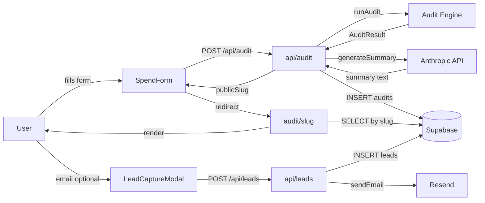

# Architecture

## System Diagram

## Data Flow

A user's form submission becomes a `POST /api/audit` request which runs `runAudit()` synchronously server-side, calls Anthropic for a ~100-word summary paragraph, stores the full `AuditResult` JSON in Supabase's `audits` table, and returns the `publicSlug` to the client. The client redirects to `/audit/[slug]`, which is a Next.js App Router server component — Supabase is queried at request time so OG meta tags are populated correctly for social crawlers.

After results render, a modal appears after 2 seconds offering email capture. On submit, `POST /api/leads` stores the lead in the private `leads` table (never exposed in public URLs) and triggers a transactional email via Resend.

## Why Next.js App Router

SSR is the critical requirement. The `/audit/[slug]` page must return populated `<meta og:title>` tags when LinkedIn/Twitter/Slack crawl it. Client-side rendering makes this impossible without a separate OG image service. App Router gives us SSR with zero extra infrastructure.

## Key Architectural Decisions

| Decision | Choice | Reason |
|---|---|---|
| Audit logic | Deterministic rules, no AI | Finance-literate output requires determinism; AI is only for the summary paragraph |
| AI summary | Non-blocking, fallback template | Results page never waits on Anthropic; any failure degrades gracefully |
| Storage | Supabase JSONB blob | The audit schema is read-mostly and schema-free; no ORM overhead needed |
| PII isolation | Separate `leads` table | Email/company never appears in the public `audits` table or public URLs |
| Rate limiting | Simple IP hash + DB counter | Sufficient for a free tool; no Redis required at this scale |

## Scaling to 10k Audits/Day

- Move Anthropic call to a background queue (Vercel Queues) — return `auditId` immediately, poll for summary readiness
- Wrap `getAuditBySlug` with `unstable_cache` for edge caching of result pages (they are immutable once created)
- Add a Postgres read replica for result page fetches
- Replace djb2 IP hash with a proper HMAC for rate limiting
